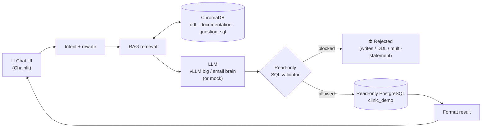

# 🏥 Text-to-SQL RAG Assistant

Ask a hospital/clinic database questions in **plain language** — *"How many
patients are there?"*, *"¿Cuántos pacientes hay?"*, *"What are the most common
diagnoses?"* — and get an answer backed by a real, **read-only** SQL query. It
retrieves the relevant schema with RAG, generates SQL with a self-hosted LLM,
validates that the SQL is read-only, runs it against a sample PostgreSQL
database, and summarises the result.

**Runs on a laptop with no GPU.** A built-in mock mode means `docker compose up`
gives you a working assistant over a synthetic database in one command — no model
server required.


<!-- After pushing to GitHub, replace OWNER/REPO to enable the live CI badge:
 -->

> ⚠️ **Demo project on 100% synthetic data.** The schema, the records, and the
> clinic itself are fictional. Not affiliated with any organisation or real
> system.

---

## Architecture



A question flows left-to-right: the chat UI classifies and rewrites it, RAG pulls
the relevant schema/notes/examples out of three ChromaDB collections, the LLM
drafts a query, a **read-only validator** gates it, and only then does it touch a
read-only PostgreSQL connection.

---

## Quickstart

### Mock mode (default — no GPU, no model server)

```bash
git clone <this-repo> && cd text-to-sql-rag
docker compose up --build
```

Then open **http://localhost:8000** and log in with **`demo` / `demo`**.

On first start the stack:
1. brings up PostgreSQL with two databases (`clinic_demo` + `chainlit`),
2. runs Flyway migrations (schema + obviously-fake seed data, read-only role),
3. syncs the RAG seed corpus into ChromaDB (wait for `STARTUP SYNC: complete`),
4. serves the chat UI on port 8000.

Try: *"How many patients are there?"*, *"¿Cuántos pacientes hay?"*,
*"What are the most common diagnoses?"*, *"How many visits per department?"*.

> In mock mode the "LLM" returns hand-written SQL for a set of sample questions.
> That SQL still goes through the **real** validator and runs against the **real**
> (synthetic) database — so the whole pipeline is genuinely exercised.

### Real mode (self-hosted vLLM)

Stand up two OpenAI-compatible vLLM servers (see [infra/](infra/README.md)), then:

```bash
cp .env.example .env
# set:
#   LLM_MODE=vllm
#   VLLM_BIG_BRAIN_BASE_URL=http://<host>:8000/v1
#   VLLM_SMALL_BRAIN_BASE_URL=http://<host>:8001/v1
docker compose up --build
```

Real mode also switches retrieval to multilingual **`bge-m3`** embeddings (build
the image with `INSTALL_EMBEDDINGS=true`).

---

## How it works

The LLM doesn't know the database schema on its own. The system bridges that gap
with **Retrieval-Augmented Generation**:

- **Store** — the DDL, business notes, and example question→SQL pairs live in
  three ChromaDB collections (`ddl`, `documentation`, `question_sql`). "Training"
  here means loading curated context for retrieval — no weights are fine-tuned.
- **Retrieve** — for each question, the most relevant context is gathered by a
  four-tier priority merge:

  | Priority | Source | What it contributes |
  |---|---|---|
  | **P1** | Semantic search | Nearest tables/notes by cosine similarity |
  | **P2** | Example SQL | Tables referenced in retrieved Q→SQL pairs |
  | **P3** | Relationships | Tables named in `-- Joins:` DDL annotations |
  | **P4** | Keywords | Substring matches on the question |

  When the same table surfaces from several sources, the highest-priority source
  wins ([app/retrieval.py](app/retrieval.py)).
- **Generate** — the retrieved context is injected into the prompt and the LLM
  produces a single `SELECT`.
- **Validate** — the SQL is checked to be read-only (twice — see Security).
- **Execute & format** — it runs on a fresh read-only connection (row-capped),
  and the result is summarised in the user's language.

### Dual-brain routing

Two models balance cost/speed against accuracy; the UI labels which "brain"
handled each step.

| Task | Brain |
|---|---|
| Intent classification | code only (keywords, zero latency) |
| Question rewriting, **SQL generation** | **Big Brain** (large dense model) |
| Response formatting, feedback parsing, general chat | **Small Brain** (small quantized model) |

### Conversation persistence & feedback

Conversations are persisted via Chainlit's standard SQLAlchemy data layer
(threads, steps, feedback) — ordinary application **audit logging**. After each
data answer the user is asked to confirm correctness; confirmed-good pairs can be
curated into the seed examples to improve retrieval over time.

---

## Security (of this demo)

Defense-in-depth keeps generated SQL strictly read-only:

- **Database-level read-only role.** The app connects to `clinic_demo` as a role
  granted only `SELECT` ([flyway/clinic/V3__grant_readonly.sql](flyway/clinic/V3__grant_readonly.sql)).
  This is the real safety net — even a validator bypass can't write.
- **Two independent validation passes.** Every query is checked by
  [app/validator.py](app/validator.py) once in the pipeline layer and again in
  the execution layer. It blocks `INSERT/UPDATE/DELETE/DROP/ALTER/CREATE/`
  `TRUNCATE/GRANT/REVOKE/EXEC`, data-modifying CTEs, `SELECT … INTO`,
  multi-statement (stacked) queries, and dangerous functions — and ignores
  keywords hidden inside string literals or comments.
- **Read-only connection** with `default_transaction_read_only=on`, a statement
  timeout, and a row cap; a fresh connection per query (no pooling carry-over).
- **bcrypt** password hashing for login credentials.
- **Pinned Python dependencies** ([requirements.txt](requirements.txt)) and a
  strict [.dockerignore](.dockerignore).
- **SQL hidden from users** unless `DEBUG_CHAT=true`.

The validator is covered by an extensive test suite (see [Testing](#testing)).

---

## Tech stack

| Layer | Choice |
|---|---|
| Chat UI | Chainlit (Python) |
| LLM serving | vLLM, OpenAI-compatible API — dual "big/small brain" routing |
| Embeddings | `BAAI/bge-m3` (multilingual) in real mode; offline hashing embedder in mock mode |
| Vector store | ChromaDB (persistent) — `ddl` / `documentation` / `question_sql` |
| Database | PostgreSQL 16 (read-only target + Chainlit/audit DB) |
| Migrations | Flyway |
| Packaging | Docker + Docker Compose (base + local override) |
| CI | GitHub Actions (pytest) |
| Language | Python 3.12 |

Python dependencies are fully version-pinned. Base **image** tags use stable
majors for portability (pin to digests for production reproducibility).

---

## Project structure

```
text-to-sql-rag/
├── app/                         # application code
│   ├── chainlit_app.py          #   Chainlit UI, auth, routing, feedback loop
│   ├── config.py                #   env-driven settings
│   ├── validator.py             #   read-only SQL validation (stdlib only)
│   ├── retrieval.py             #   RAG priority-merge logic (stdlib only)
│   ├── embeddings.py            #   bge-m3 + offline embedders
│   ├── engine.py                #   Text2SQLEngine: ChromaDB, retrieval, execution
│   ├── llm.py                   #   dual-brain vLLM client + mock short-circuit
│   ├── mock_responses.py        #   canned SQL for offline mode
│   ├── nodes.py                 #   pipeline: intent → rewrite → … → format
│   ├── prompts.py               #   system prompts
│   ├── seed_clinic.py           #   synthetic DDL / docs / example pairs
│   ├── seed_training.py         #   idempotent seed orchestration
│   └── chainlit_db.py           #   auth + feedback (sync)
├── flyway/
│   ├── clinic/                  #   sample DB: schema, fake seed, read-only grant
│   └── chainlit/                #   data-layer + user_credentials + sql_feedback
├── db/init/                     # create 2nd DB + read-only role on first boot
├── tests/                       # pytest: validator, retrieval, mock, embeddings
├── infra/                       # genericized vLLM server compose files (GPU)
├── scripts/create_user.py       # create/update a login user
├── shell/migrate.sh             # manual Flyway runner
├── .github/workflows/ci.yml     # run tests on push/PR
├── docker-compose.yml           # base (registry images, prod-shaped)
├── docker-compose.override.yml  # local: build from source + mounted migrations
├── Dockerfile / Dockerfile.flyway
├── requirements*.txt            # pinned deps (core / embeddings / dev)
└── .env.example                 # all config, placeholders only
```

---

## What this demonstrates

| Area | In this repo |
|---|---|
| **Backend engineering** | Python service, layered pipeline, env-driven config, Postgres, migrations, Docker Compose |
| **RAG** | ChromaDB collections, multilingual embeddings, a four-tier retrieval-priority merge |
| **Self-hosted LLM infra** | vLLM OpenAI-compatible serving, dual-model (big/small) routing, mock fallback for GPU-free runs |
| **Defense-in-depth SQL safety** | Two validation passes + a database-level read-only role, thoroughly unit-tested |
| **CI/CD** | GitHub Actions test gate; build→push→deploy image pattern with base/override compose |
| **Pragmatism** | One-command demo with synthetic data, so a reviewer can actually try it |

---

## Configuration

All configuration is environment variables — see [.env.example](.env.example).
Highlights:

| Variable | Default | Purpose |
|---|---|---|
| `LLM_MODE` | `mock` | `mock` (no GPU) or `vllm` |
| `PG_USER` / `PG_PASSWORD` | `llm_readonly` / … | **read-only** clinic DB credentials |
| `EMBEDDING_PROVIDER` | _(auto)_ | `offline` in mock, `bge-m3` in vllm |
| `MAX_RESULT_ROWS` | `1000` | row cap per query |
| `DEBUG_CHAT` | `false` | show the SQL/RAG trace in chat |
| `VLLM_BIG_BRAIN_BASE_URL` | `http://<host>:8000/v1` | big-brain server (vllm mode) |
| `VLLM_SMALL_BRAIN_BASE_URL` | `http://<host>:8001/v1` | small-brain server (vllm mode) |

---

## Testing

The security-critical and retrieval logic is dependency-free and unit-tested:

```bash
pip install -r requirements-dev.txt
pytest
```

Covers: the SQL validator (blocks writes/DDL/multi-statement/CTE-writes/dangerous
functions; allows real SELECTs, even ones with scary words inside string
literals), the RAG priority-merge logic, mock-mode SQL (asserted valid by the
validator), and the offline embedder. CI runs them on Python 3.11 and 3.12.

---

## CI/CD & deployment pattern

Compose uses the standard base + override split:

- **`docker-compose.yml`** (base) references registry images
  (`registry.example.com/<org>/text2sql:<tag>`) — prod-shaped.
- **`docker-compose.override.yml`** (auto-merged locally) builds from source and
  mounts the local migrations — so local `docker compose up` needs no registry.

A production pipeline would build & push the app and Flyway images on a version
tag, then deploy by pulling on the target host (only the base compose runs there).

---

## License

[MIT](LICENSE).
